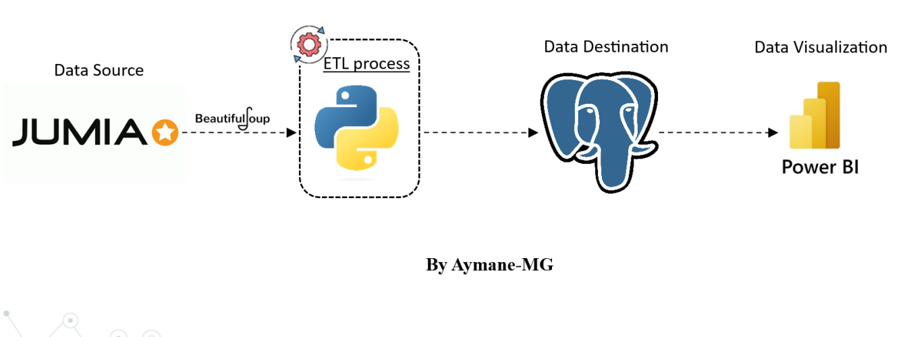
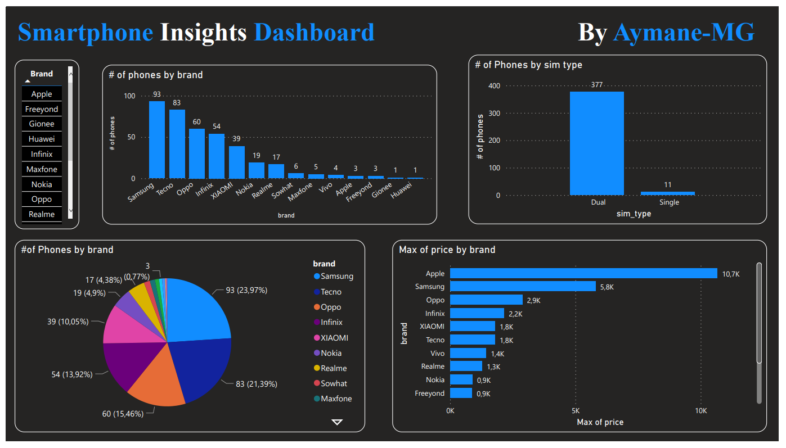

# ETL-Club-Datai


## Data Pipeline
Here is the data pipeline :



## Dashboard

Here is the  Dashboard created in Power BI:




## Repository Structure

```batch
\---ETL-Club-Datai
    |   README.md
    |
    +---ETL-Project
    |   |   data_loading.ipynb
    |   |   Mobile_phone_data_scraping.py
    |   |   Smartphone_data_transformation.ipynb
    |   |
    |   +---cleaned_data
    |   |       smartphone_Data.csv
    |   |
    |   +---DashBoard
    |   |       Dashboard.pbix
    |   |       Dashboard.pdf
    |   |
    |   \---raw_data
    |           jumia_mobile_phone.csv
    |
    \---PPT
            ETL - Datai Club.pdf
```


### Contacts
For any questions or further information, feel free to contact me :)

- **linkedin**: <a href="https://www.linkedin.com/in/aymane-maghouti/" target="_blank">Aymane Maghouti</a><br>
- **Email**: `aymanemaghouti@gmail.com`
